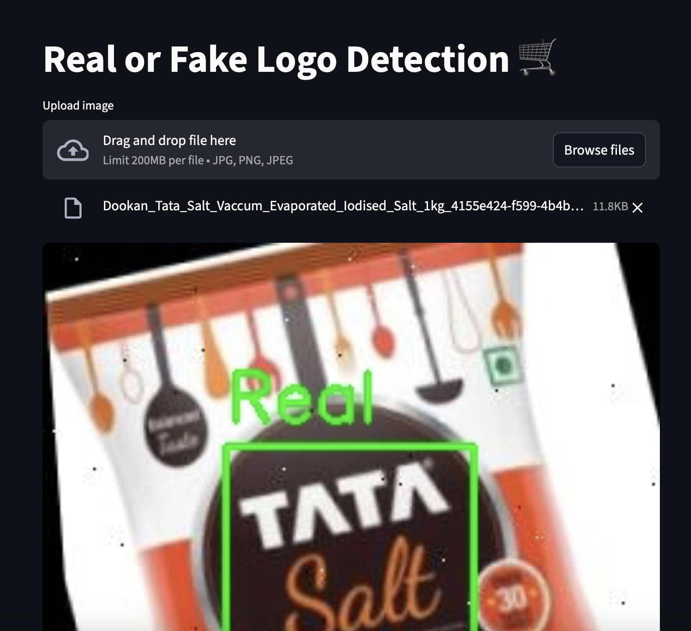

## 🛒 Logo Detection and Real/Fake Classification (Grocery Products)

This project is designed to detect brand logos on grocery products and classify them as Real ✅ or Fake ❌.

It’s a skill-building project to showcase end-to-end AI/ML development:
* Data preparation (real vs synthetic logos)
* Model training (detection + classification)
* Deployment (Streamlit app for easy use)

🚀 What it Does

* Detects grocery product logos in an image.
* Classifies the detected logo as Real or Fake.
* Provides an interactive Streamlit interface.

## 📸 Demo

